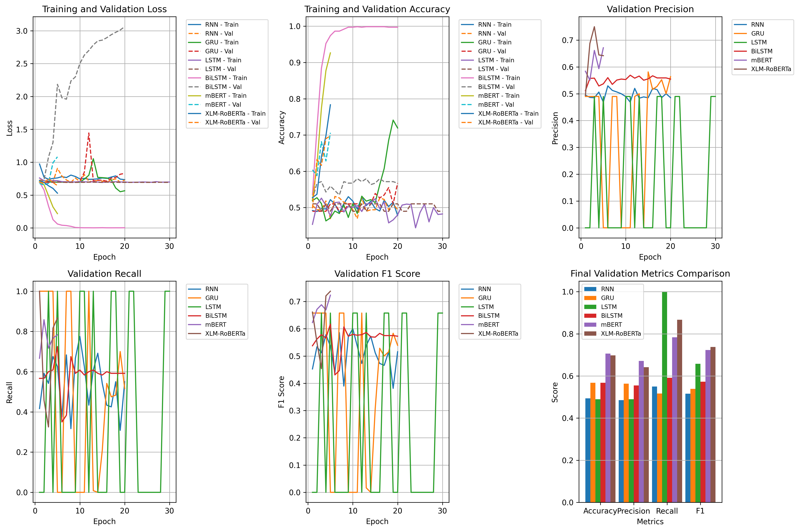
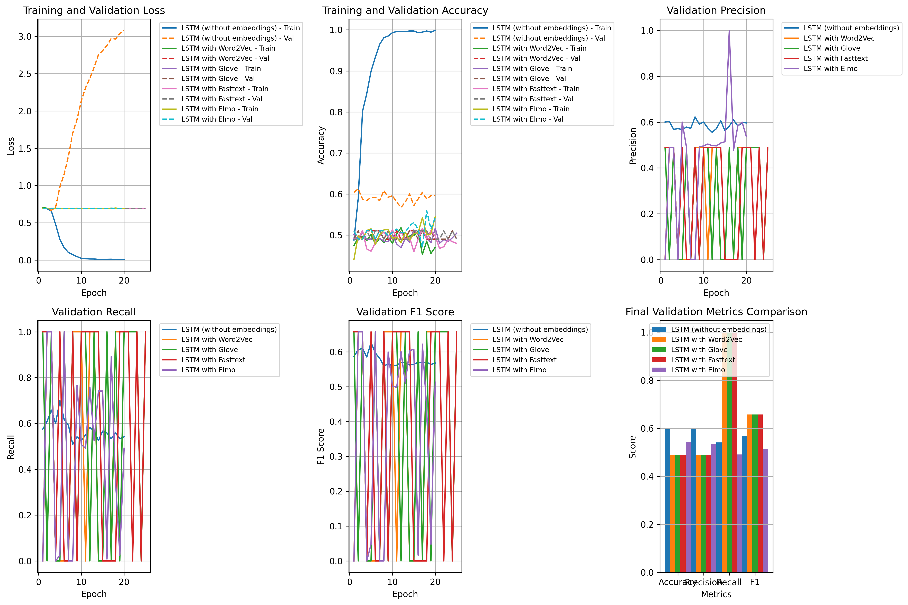
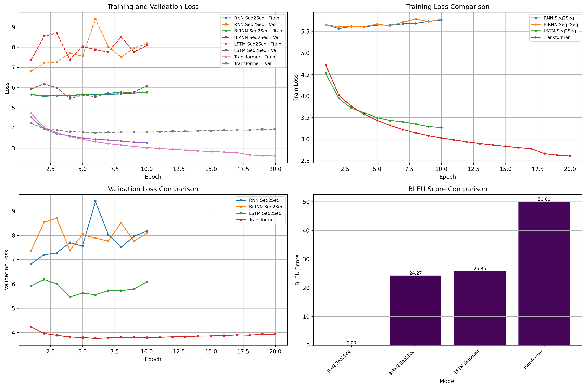
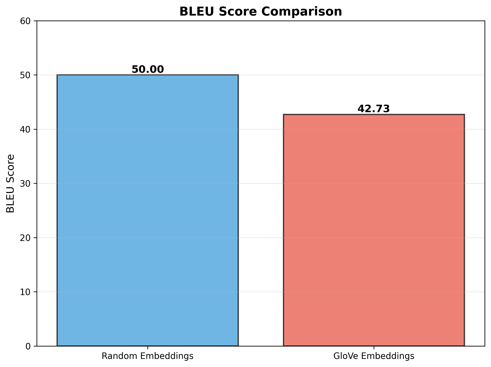
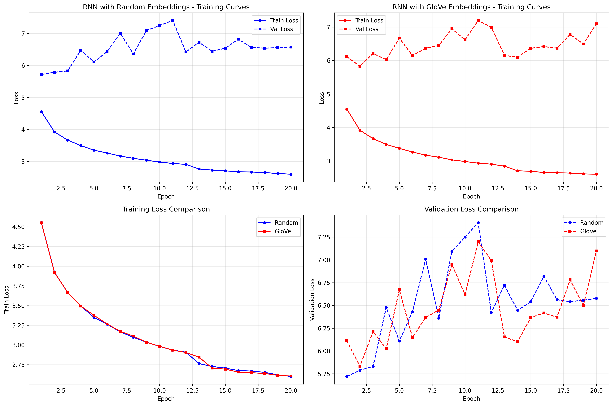

# NLP Assignment 2: Urdu Language Processing
## Comprehensive Results Summary

## Question 1: Sentiment Analysis on Urdu Tweets
### Models & Hyperparameters
| Model       | Embedding | Hidden | Layers | Dropout | Batch | LR    | Epochs |
|-------      |-----------|--------|--------|---------|-------|----   |--------|
| RNN         | 128       | 256    | 2      | 0.3     | 32    | 0.005 | 20     |
| GRU         | 128       | 256    | 2      | 0.3     | 32    | 0.005 | 20     |
| LSTM        | 128       | 128    | 1      | 0.5     | 16    | 0.0005| 30     |
| BiLSTM      | 128       | 256    | 2      | 0.3     | 32    | 0.005 | 20     |
| mBERT       | -         | -      | -      | 0.3     | 16    | 2e-5  | 5      |
| XLM-RoBERTa | -         | -      | -      | 0.3     | 16    | 2e-5  | 5      |

### Performance Results
| Model | Accuracy | Precision | Recall | F1-Score |
|-------|----------|-----------|--------|----------|
| RNN   | 49.4%    | 0.485     | 0.550  | 0.516    |
| GRU   | 56.7%    | 0.564     | 0.517  | 0.539    |
| LSTM  | 49.0%*   | 0.490*    | 1.000* | 0.658*   |
| BiLSTM| 56.7%    | 0.555     | 0.592  | 0.573    |
| mBERT | 70.6%    | 0.671     | 0.783  | 0.723    |
| **XLM-RoBERTa** | **69.8%** | **0.642** | **0.867** | **0.738** |

*LSTM exhibits mode collapse
### Training Metrics


**Best Model: XLM-RoBERTa (F1: 0.738, Recall: 0.867) - Best overall performance for sentiment detection**

## Question 2: Impact of Word Embeddings on Sentiment Analysis
### Models & Hyperparameters
| Model               | Input/Emb Dim | Hidden | Layers | Dropout | Batch | LR    | Epochs |
|-------              |---------------|--------|--------|---------|-------|-----  |------  |
| LSTM (no embedding) | 1000 (TF-IDF) | 256    | 2      | 0.3     | 32    | 0.001 | 20     |
| LSTM + Word2Vec     | 128           | 256    | 2      | 0.3     | 32    | 0.005 | 20     |
| LSTM + GloVe        | 128           | 256    | 2      | 0.3     | 32    | 0.001 | 25     |
| LSTM + FastText     | 128           | 256    | 2      | 0.3     | 32    | 0.001 | 25     |
| LSTM + ELMo         | 1024          | 256    | 2      | 0.3     | 32    | 0.001 | 20     |

### Performance Results
| Model                        | Accuracy | Precision | Recall | F-Score |
|------------------------------|----------|-----------|--------|---------|
| LSTM (without embeddings)    | 0.596    | 0.596     | 0.542  | 0.568   |
| LSTM with Word2Vec           | 0.490*   | 0.490*    | 1.000* | 0.658*  |
| LSTM with GloVe              | 0.490*   | 0.490*    | 1.000* | 0.658*  |
| LSTM with FastText           | 0.490*   | 0.490*    | 1.000* | 0.658*  |
| LSTM with ELMo               | 0.543    | 0.536     | 0.492  | 0.513   |

*Mode collapse - all predict positive class

### Training Metrics


**Best Model: Random Embeddings (F1: 0.568) - Custom-trained embeddings on small data (~700 sentences) cause mode collapse**

## Question 3: Neural Machine Translation (English → Urdu)
### Models & Hyperparameters
| Model         | Emb Dim | Hidden | Layers | Dropout | LR    | Epochs | Notes                  |
|-------        |---------|--------|--------|---------|-----  |--------|-------                 |
| RNN Seq2Seq   | 128     | 256    | 1      | 0.1     | 0.01  | 10     | -                      |
| BiRNN Seq2Seq | 128     | 256    | 1      | 0.1     | 0.01  | 10     | -                      |
| LSTM Seq2Seq  | 128     | 256    | 1      | 0.1     | 0.01  | 10     | -                      |
| Transformer   | 128     | 256    | 2      | 0.1     | 0.001 | 20     | 4 heads, FF: 256       |
| mBART-50      | -       | -      | -      | -       | -     | -      | Zero-shot, pre-trained |

### Performance Results
| Model               | BLEU Score |
|---------------------|------------|
| RNN Seq2Seq         | 0.00       |
| BiRNN Seq2Seq       | 24.27      |
| LSTM Seq2Seq        | 25.85      |
| Transformer         | 50.00      |
| mBART-50 (zero-shot)| 0.00*      |

*BLEU score affected by tokenization mismatch

### Training Metrics


**Best Model: mBART-50 (zero-shot) - Only model producing grammatically correct, semantically accurate translations**

## Question 4: GloVe Embeddings Impact on Translation
### Models & Hyperparameters
| Model             | Emb Dim | Hidden | Layers | Dropout | LR    | Epochs | Optimizer |
|-------            |---------|--------|--------|---------|-----  |--------|-----------|
| Random Embeddings | 100     | 128    | 1      | 0.0     | 0.001 | 20     | Adam      |
| GloVe Embeddings  | 100     | 128    | 1      | 0.0     | 0.001 | 20     | Adam      |

### Performance Results
| Model             | BLEU Score | Final Val Loss | Training Time (s) | Avg Time/Epoch (s) |
|-------            |------------|----------------|-------------------|------------------- |
| Random Embeddings | 50.00      | 6.577          | 1,287.71          | 64.39              |
| GloVe Embeddings  | 42.73      | 7.099          | 1,871.35          | 93.57              |

**Impact**: GloVe hurts performance (-14.5% BLEU) and increases training time (+45%)

### Training Curves



**Best Model: Random Embeddings (BLEU: 50.00) - Pre-trained English GloVe embeddings don't help English→Urdu translation**

## How to Run
```bash
# Install dependencies
pip install -r requirements.txt

# Run individual questions
cd Q1 && python main.py
cd Q2 && python main.py
cd Q3 && python main.py
cd Q4 && python main.py
```